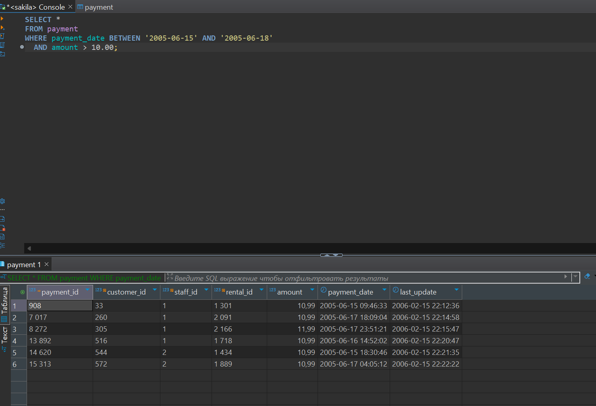
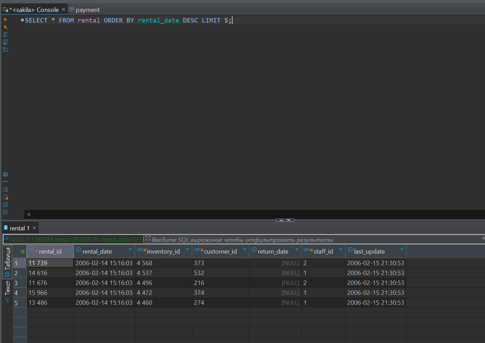

# SQL. Часть 1

## Задание 1

Получите уникальные названия районов из таблицы с адресами, которые начинаются на “K” и заканчиваются на “a” и не содержат пробелов.

```sql
SELECT DISTINCT district
FROM address
WHERE district LIKE 'K%'
  AND district LIKE '%a'
  AND district NOT LIKE '% %';
```


## Задание 2

Получите из таблицы платежей за прокат фильмов информацию по платежам, которые выполнялись в промежуток с 15 июня 2005 года по 18 июня 2005 года включительно и стоимость которых превышает 10.00.

```sql
SELECT *
FROM payment
WHERE payment_date BETWEEN '2005-06-15' AND '2005-06-18 23:59:59'
  AND amount > 10.00;
```



## Задание 3

Получите последние пять аренд фильмов.

```sql
SELECT * FROM rental ORDER BY rental_date DESC LIMIT 5;
```



## Задание 4

Одним запросом получите активных покупателей, имена которых Kelly или Willie.

Сформируйте вывод в результат таким образом: все буквы в фамилии и имени из верхнего регистра переведите в нижний регистр,
замените буквы 'll' в именах на 'pp'.

```sql
SELECT CONCAT(REPLACE(LOWER(c.first_name), 'll', 'pp'), ' ', LOWER(c.last_name)) AS modified_name
FROM customer c
WHERE (c.first_name = 'Kelly' OR c.first_name = 'Willie')
  AND active = 1;
```


## Задание 5\*

Выведите Email каждого покупателя, разделив значение Email на две отдельных колонки: в первой колонке должно быть значение, указанное до @, во второй — значение, указанное после @.

```sql
SELECT
    SUBSTRING_INDEX(email, '@', 1) AS email_prefix,
    SUBSTRING_INDEX(email, '@', -1) AS email_suffix
FROM customers;
```


Задание 4\*

Доработайте запрос из предыдущего задания, скорректируйте значения в новых колонках: первая буква должна быть заглавной, остальные — строчными.

```sql
SELECT
    CONCAT(UPPER(SUBSTRING(SUBSTRING_INDEX(email, '@', 1), 1, 1)), LOWER(SUBSTRING(SUBSTRING_INDEX(email, '@', 1), 2))) AS email_prefix,
    CONCAT(UPPER(SUBSTRING(SUBSTRING_INDEX(email, '@', -1), 1, 1)), LOWER(SUBSTRING(SUBSTRING_INDEX(email, '@', -1), 2))) AS email_suffix
FROM customer;
```


